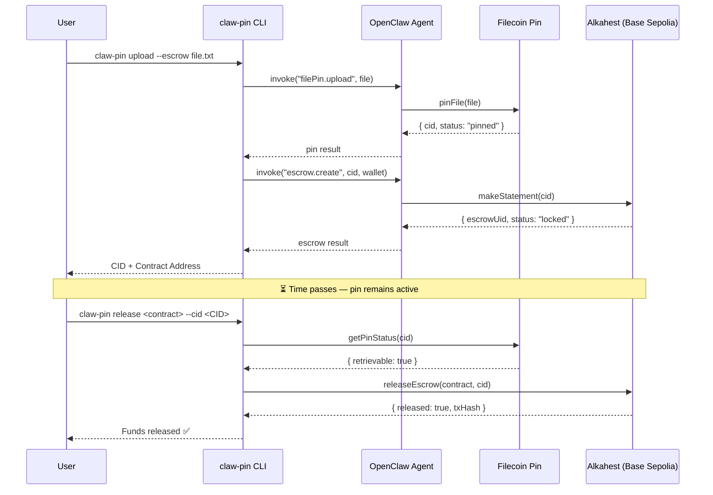
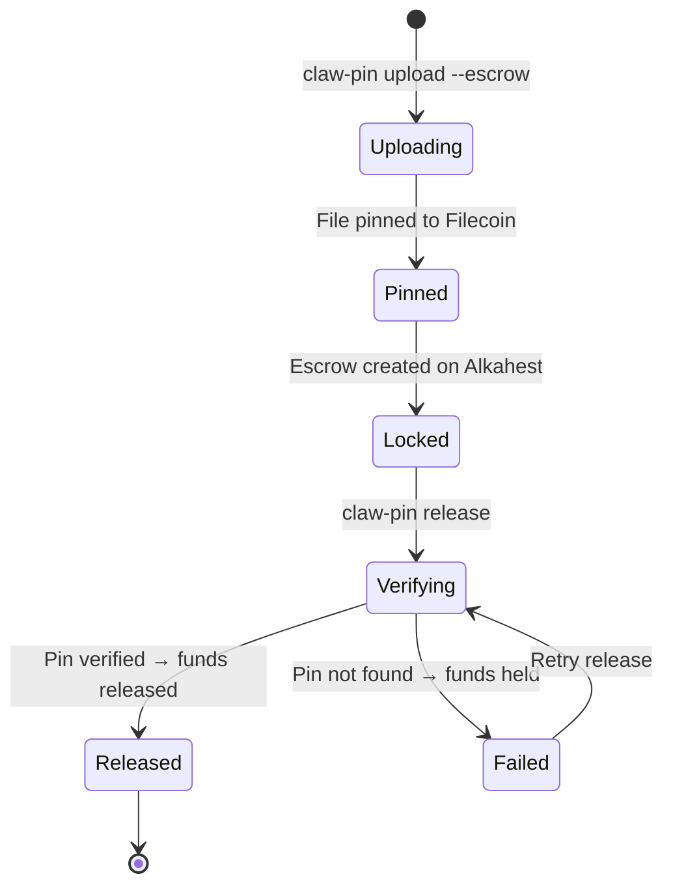

# 💸 Escrow Payment Flow — claw-pin

## Overview

The escrow system uses **Alkahest** on Base Sepolia to create trustless conditional payments tied to Filecoin CID pins. Funds are locked when a file is uploaded with `--escrow` and released only after pin verification confirms the data is stored.

## Lifecycle Diagram

## State Machine

## Commands

| Command | Action | Chain |
|:---|:---|:---|
| `claw-pin init` | Generate wallet (0x address) | — |
| `claw-pin upload --escrow <file>` | Pin file + lock escrow | Filecoin + Base Sepolia |
| `claw-pin release <contract> --cid <CID>` | Verify pin + release funds | Filecoin + Base Sepolia |

## Environment Variables

| Variable | Required | Description |
|:---|:---|:---|
| `PRIVATE_KEY` | Yes | Wallet private key (0x...) |
| `WALLET_ADDRESS` | Yes | Wallet address (0x...) |
| `FILECOIN_NETWORK` | No | `calibration` (default) or `mainnet` |
| `BASE_SEPOLIA_RPC_URL` | No | Base Sepolia RPC (default: https://sepolia.base.org) |

## Security Notes

- Private keys are stored in `.env.wallet` (gitignored)
- Escrow funds are locked on-chain — only the wallet owner can release
- Pin verification happens before any fund release
- Use Calibration testnet for testing (no real funds at risk)
